## Telegram-бот для расчёта нормы воды, калорий и трекинга активности.
Бот написан на aiogram-3.17.0. Данные записываются в базу данных, используется библиотека aiosqlite-0.20.0. Для расчётов в формулах используется температура наружного воздуха, получаемая по API openweathermap.org. Для получения калорийности продуктов выполняются запросы на API trackapi.nutritionix.com, используется библиотека aiohttp-3.11.11. Реализован перевод текста запроса пользователя с русского на английский язык, при помощи библиотеки translate-3.6.1. Заполненный профиль пользователя сохраняется в базе данных и при повторном входе загружается из неё. Данные логирования калорий и воды обнуляются каждый день. При вызове команды /check_progress выводится отчёт о полученных калориях и воде, а также информация о дневных нормах. Также строятся графики с информацией о прогрессе. 
### Команда /set_profile

### Редактирование нормы пользователем

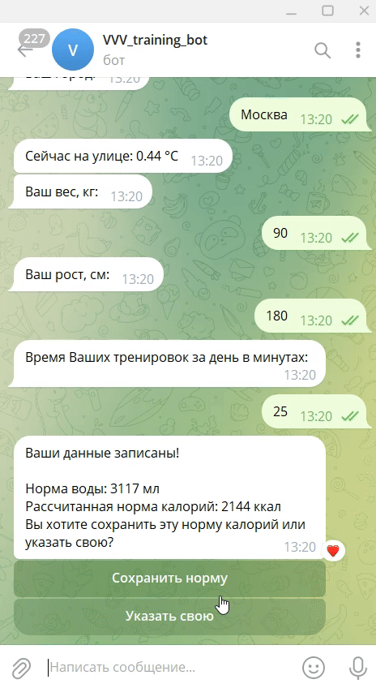

### Команда /show_profile

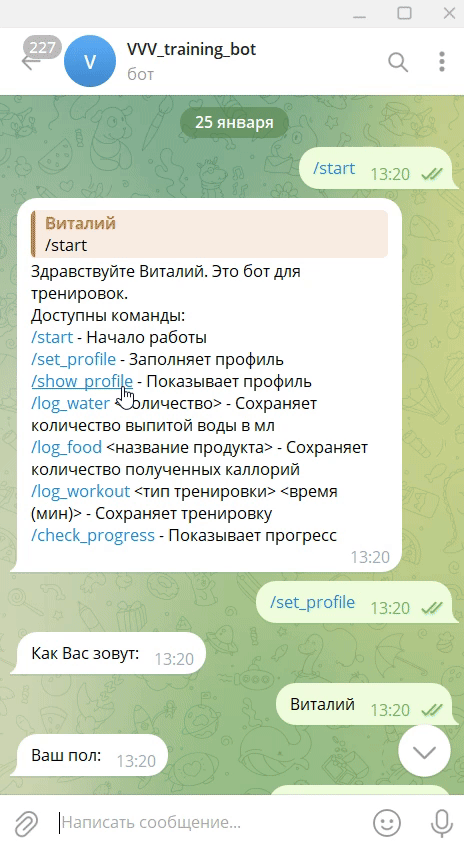

### Команда /log_water

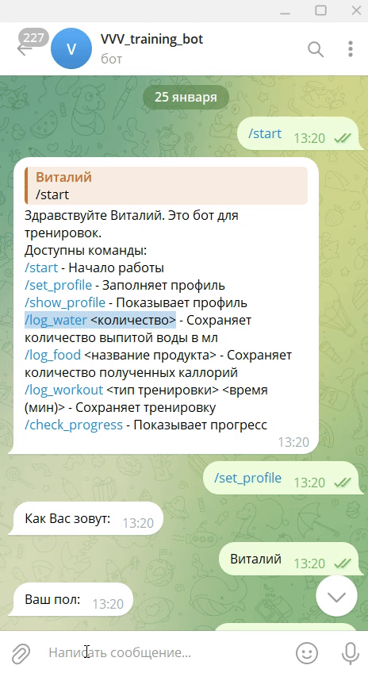

### Команда /log_food

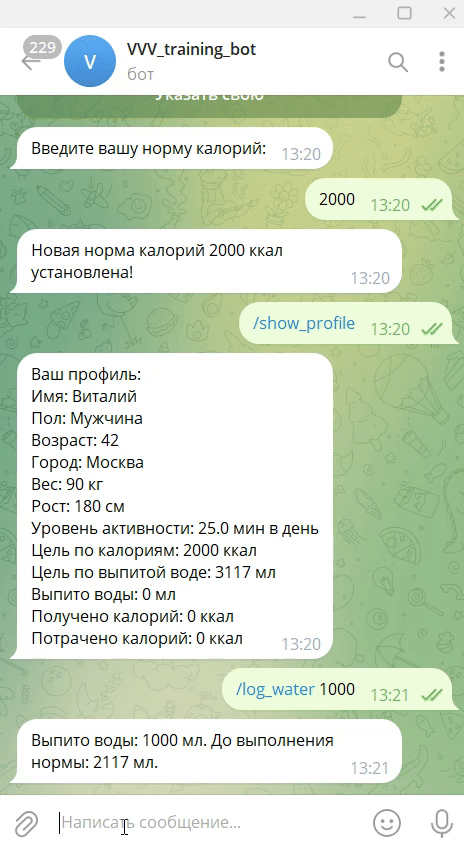

### Команда /log_workout

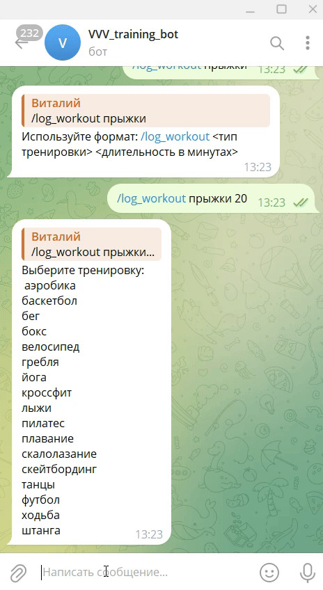

### Команда /check_progress

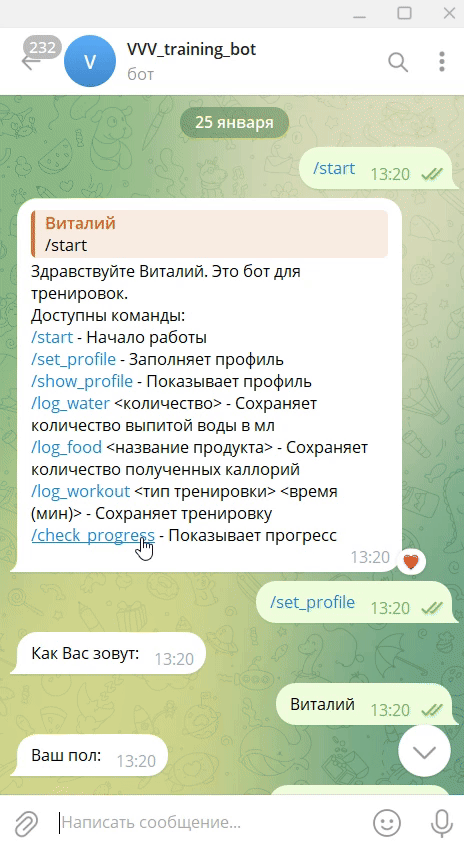

### Пересчёт прогресса

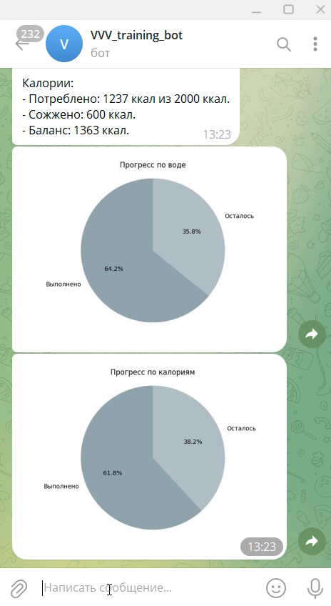

### Пересчёт прогресса в профиле

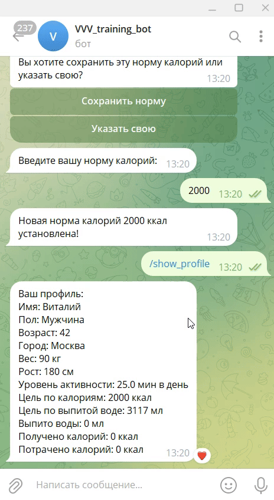

### Редактирование профиля

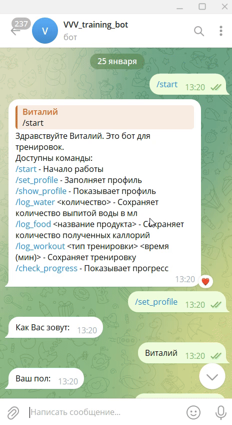

### Запуск бота на render.com

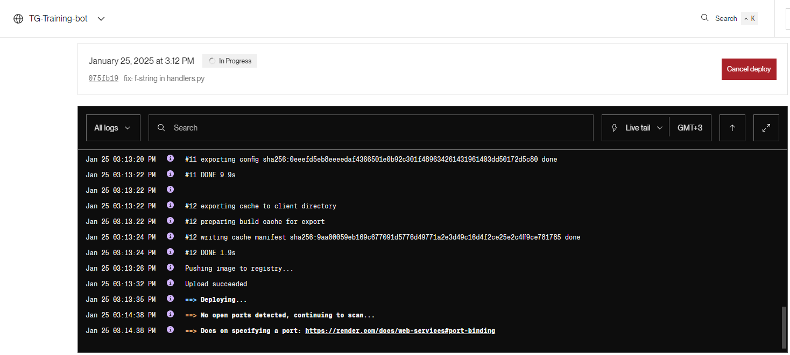

### Работа бота на render.com

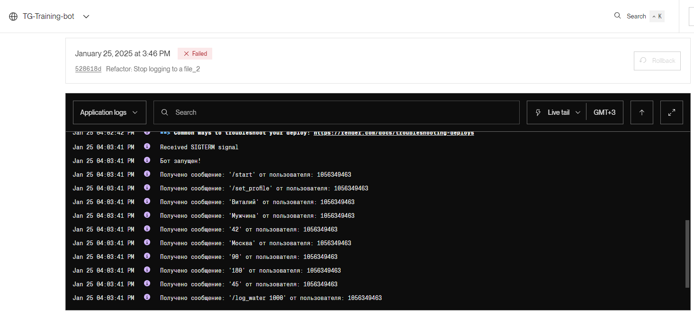
